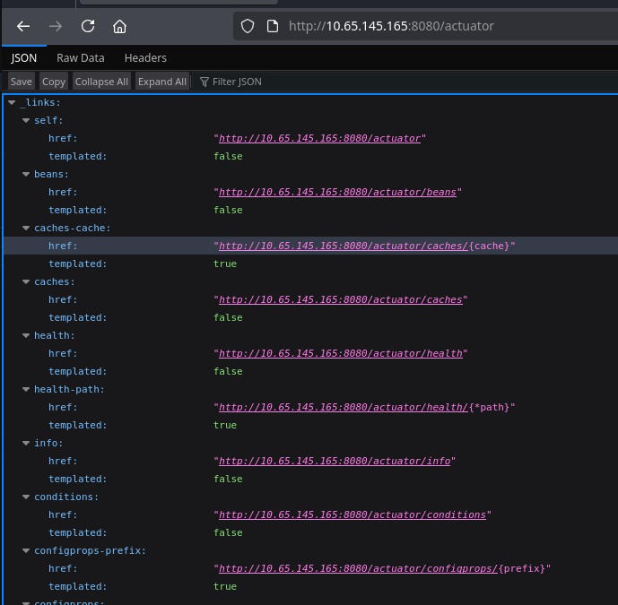

+++
title = "IronHold (Hard)"
date = "2026-08-29"
author = "berzrk"
description = "IronHold: White-box Java Spring Challenge"
+++

# Summary

We are provided with the source code for the IronHold inmate-management platform and
a running instance based on this code. The platform is built with **Java Spring Boot**.

We start by getting credentials to login from a **misconfigured public
endpoint**. With this credentials, we can abuse an Union-based SQL
Injection to read a database that is inaccessible from anywhere else.

We can then escalate our account to **warden** (highest privilege) by abusing an
**Insecure Design** in the update profile endpoint.

Finally with the highest privilege, we can make use of a **deserialization attack**
to achieve **RCE**.

> This challenge was interesting because I myself don't have much programming
> experience with Java and even less with Spring Framework. But I do have
> experience with back-end and API development in Python (with FastAPI) and
> some understanding of Java design practices (Controller, Repository, Model pattern)

# Flag 1

I start by accessing the webpage and I am redirected to a login page.
The `/login` endpoint code looks like this


@PostMapping("/login")
public String login(@RequestParam String username,
                        @RequestParam String password,
                        HttpSession session,
                        Model model) {
    Staff staff = staffRepository.findByUsername(username);
    if (staff == null || !passwordEncoder.matches(password, staff.getPassword())) {
        model.addAttribute("error", "Invalid staff credentials.");
        return "login";
    }
    session.setAttribute(SessionUtil.USERNAME_KEY, staff.getUsername());
    return "redirect:/dashboard";
}


I immediately notice that it is vulnerable to a **timing attack**. But its not the
expected approach in this case. Except for that, there is no other flaw that
would allow a login.

I find an interesting file that shows which endpoints are protected by a login


@Configuration
public class WebMvcConfig implements WebMvcConfigurer {
    --snip--
    @Override
    public void addInterceptors(InterceptorRegistry registry) {
        registry.addInterceptor(authInterceptor)
                .addPathPatterns("/**")
                .excludePathPatterns(
                        "/", "/login", "/logout", "/about", "/status",
                        "/css/**", "/error", "/actuator/**");

        registry.addInterceptor(wardenInterceptor)
                .addPathPatterns("/admin/**");
    }
}



The `/actuator/` endpoint is really interesting. Searching about it, it
is apparently an endpoint to monitor your application. And it leaks
a lot of valuable information that **should not be public**.

