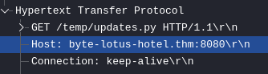
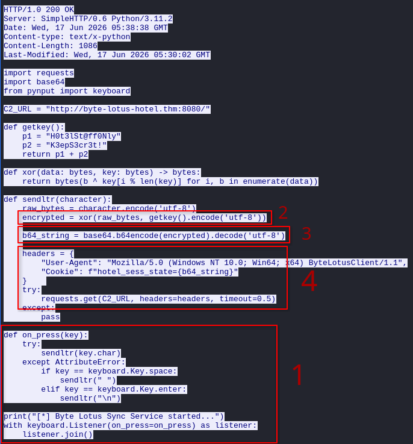
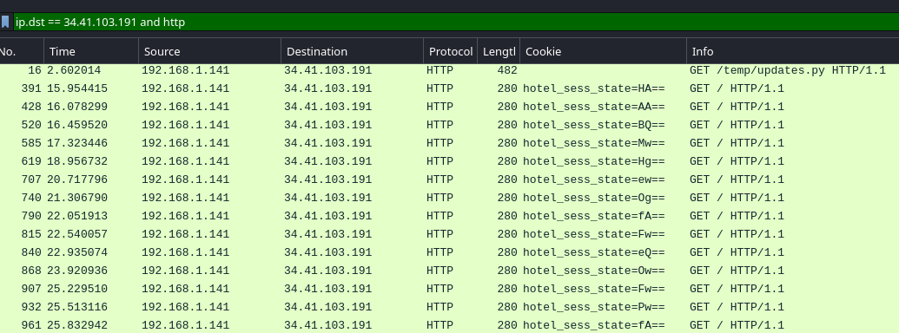
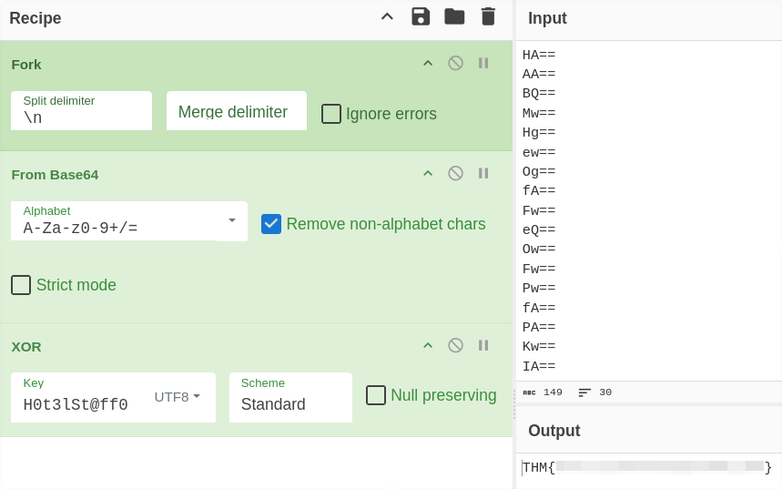

+++
title = "Packed Light (Blue)"
date = "2026-08-08"
author = "berzrk"
description = "PCAP analysis of a Python keylogger exfiltrating keystrokes over C2"
+++

We are provided the file `traffic.pcapng`.

Looking at the `http` packets, luckily the first packet is suspicious.



- Suspicious domain
- Suspicious file `updates.py`

And it is confirmed as malicious after looking at the _response_ of this request,
where it returns a **malicious Python script**



The script is a **keylogger**.

1. Store the key pressed
2. Encrypt the key using XOR with the secret key from `getkey()`
3. Base64 encode
4. Send the encoded data as cookie `hotel_sess_state` to the C2 server

And looking at the HTTP requests sent to the C2 server, we can look
at which keys were sent by the keylogger: `ip.dst == <MALICIOUS IP> and http`
and add the `Cookie` as column.



To extract all values from the cookie, we can use `tshark`:

```bash
tshark -r traffic.pcapng -Y 'http.cookie contains "hotel_sess_state"' -T fields \
-e http.cookie | cut -d '=' -f2- > keys.txt

# keys.txt will look like this:
# HA==
# AA==
# BQ==
# ...
```

All that is left to do is to decrypt these values. We just need to reverse the process
in the keylogger script: `decrypt(decode(key))`.

> XOR decryption uses the same function as encryption, as long as the key is the same.

I did this in two ways: with a Python script and [CyberChef](https://gchq.github.io/CyberChef/)

# Python Script

```python
from base64 import b64decode

key = b"H0t3lSt@ff0NlyK3epS3cr3t!"

# Same function from the malicious script
def xor(data: bytes, key: bytes) -> bytes:
    return bytes(b ^ key[i % len(key)] for i, b in enumerate(data))

with open("keys.txt", "r") as f:
    chars = f.readlines()
    for char in chars:
        decoded = b64decode(char.rstrip())
        plain = xor(decoded, key)
        print(plain.decode(), end="")
```

# CyberChef


